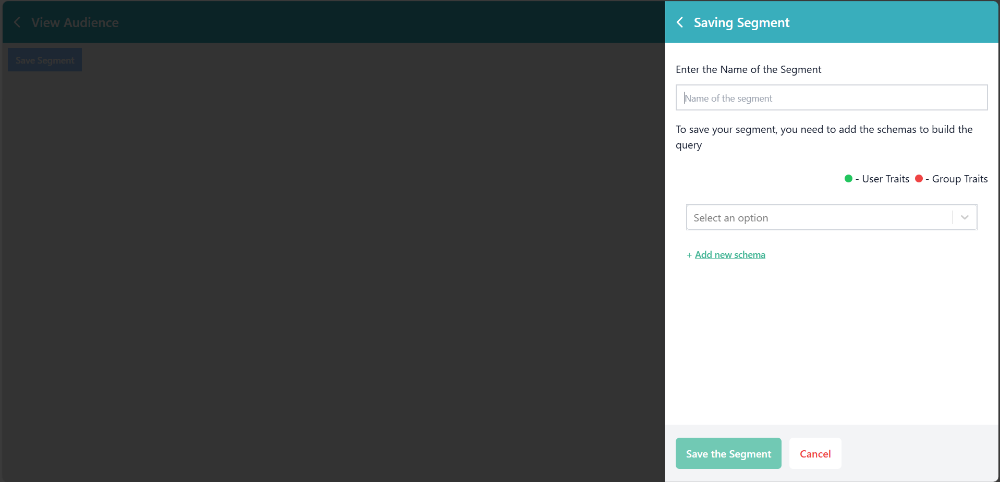
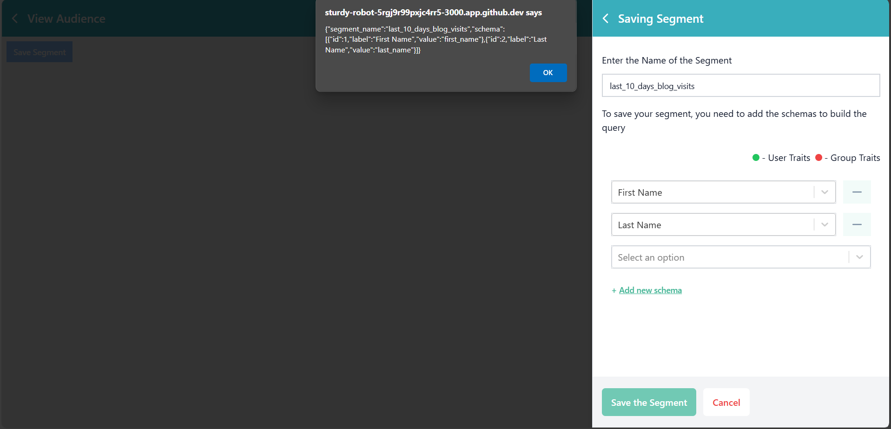

# customerLabs-assessment
## Reactjs assessment using webpack

### App Screenshots

## 1. screenshot - 1 <br/>
 
 
## 2. screenshot - 2 <br/>



### Project Setup packages list

```console
1. npm init -y
2. npm install react react-dom
3. npm install -D typescript @types/react @types/react-dom
4. npm install -D webpack webpack-cli webpack-dev-server
5. npm install -D @babel/core @babel/preset-env @babel/preset-react @babel/preset-typescript babel-loader
6. npm install -D html-webpack-plugin
7. npm install -D style-loader css-loader postcss-loader
8. npm install -D tailwindcss postcss autoprefixer
9. npm install tailwindcss-animate class-variance-authority clsx tailwind-merge
10.npm install lucide-react
11. npx shadcn@latest init
12.npm install react-router@6 react-router-dom@6
13.npm install react-hook-form zod @hookform/resolvers
14.npm install react-select
```


